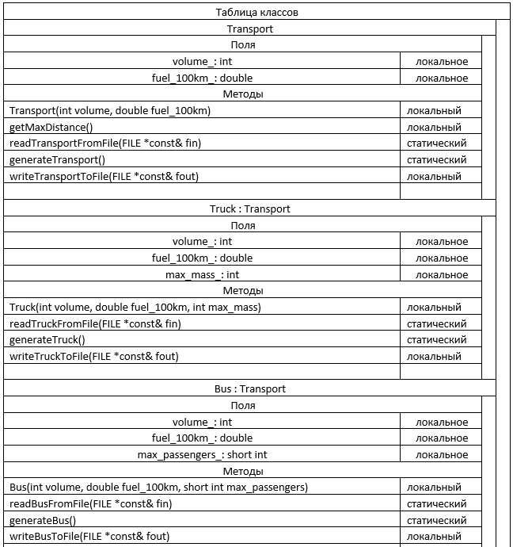
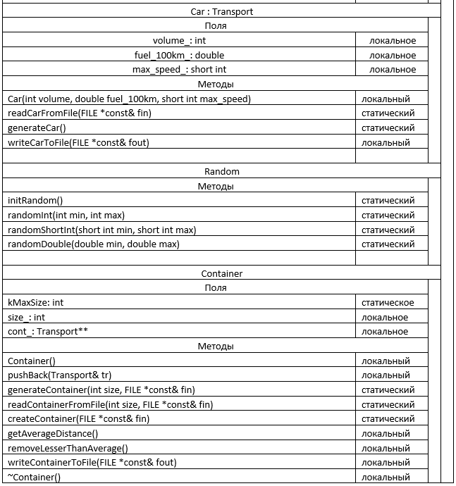
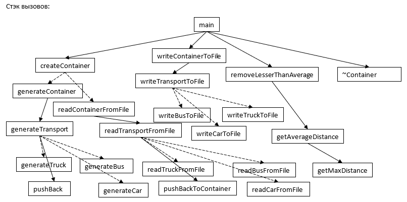

Домашнее задание №2 по Архитектуре Вычислительных Систем

# Заявка на бонус
- 1: разбиение на модули; раздельная компиляция (вынес файлы в библиотеку); применение системы сборки проектов cmake; есть тесты: с нулём элементов, с максимальным числом элементов, с полностью некорректными данными.
- 2: передача аргументов в методы по указателям и константным ссылкам - лишнее копирование не производится, причём за счёт разделения на ссылки и указатели повышается читаемость кода в точке вызова метода.
- 3: методы всех классов имеют документацию (поясняющие комментарии)

# Описание задания
Вариант №294: задача №14, функция №21. Для запуска из командной строки нужно передать в качестве аргументов названия входного и выходного файлов. Во входном файле сначала передаётся количество элементов в контейнере, а затем, если оно не превышает 20, элементы в формате "номер_типа_транспорта объём_бака расход_топлива специальные_данные_для_конкретного_типа_транспорта".

# Схема программы на базе ВС

# Метрики программы
- Общий размер файлов исходного кода: 15.1 Кб
- Размер исполняемого файла: 57 Кб
- Интерфейсных модулей: 6
- Модулей реализации: 7
- Время работы на тестах:
  - 1: 0.010с
  - 2: 0.009с
  - 3: 0.010с
  - 4: 0.010с
  - 5: 0.018с

# Сравнение с другими реализациями
Несмотря на чуть доработанные тесты, в общем тенденция ясна: программа работает почти так же, как и реализованная процедурным подходом, но чуть быстрее. При этом пришлось пожертвовать размером файлов с исходным кодом и исполняемого файла: они стали больше.
